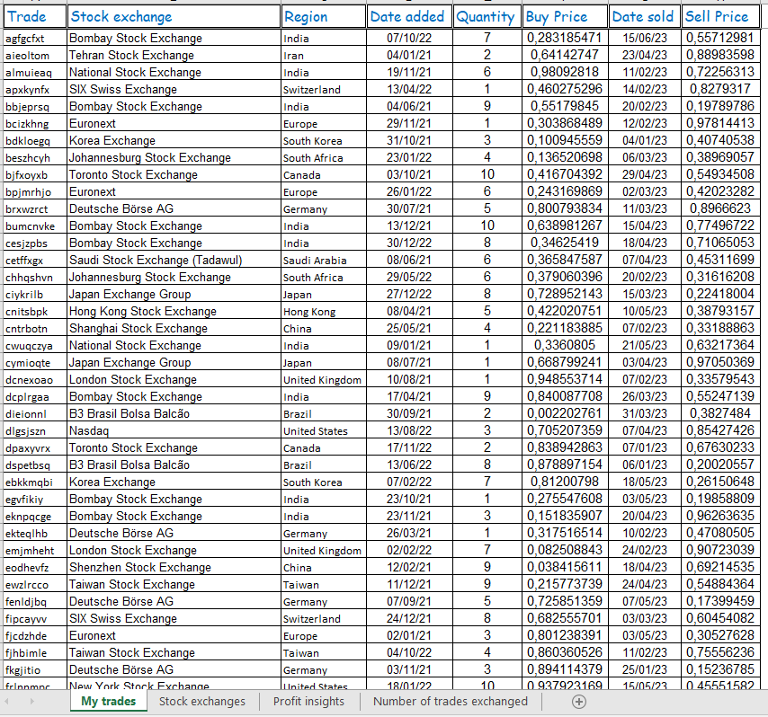
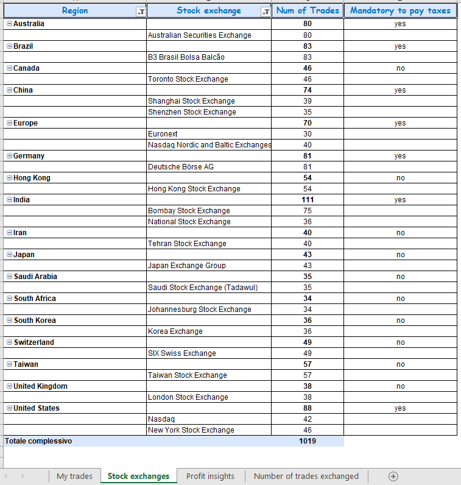
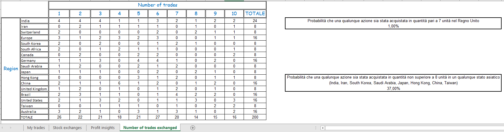

# Analisi delle Operazioni di Trading - FinTrack Solutions

Questo progetto rappresenta il caso studio finale per il corso di **Tecniche Avanzate di Analisi Dati con Excel**, realizzato all'interno del mio percorso di **Master Professionale in Data Analytics certificato da ProfessionAI e Alteredu**.

## 🎯 Obiettivo del Progetto
L'obiettivo è la trasformazione di un dataset finanziario grezzo in uno strumento di analisi dinamico e visivamente efficace per **FinTrack Solutions**. Il progetto fornisce una soluzione completa per il monitoraggio delle performance di trading dal 1° gennaio 2021 ad oggi, includendo l'automazione dei calcoli fiscali, l'analisi dei profitti e la modellazione probabilistica delle operazioni sui mercati internazionali.

## 🛠️ Tecniche Avanzate Utilizzate
Il progetto implementa metodologie analitiche sofisticate, suddivise in quattro moduli operativi:

### 1. Data Management e Strutturazione (My Trades)
*   **Normalizzazione Finanziaria:** Standardizzazione dei record di trading, inclusa la gestione rigorosa dei formati data e dei prezzi di acquisto/vendita.
*   **Ottimizzazione della Leggibilità:** Implementazione di uno styling professionale per facilitare l'auditing rapido delle transazioni voluminose.

### 2. Business Intelligence e Automazione (Stock Exchanges)
*   **Modellazione con Tabelle Pivot:** Sintesi dinamica dei mercati finanziari raggruppati per regione e volume di azioni scambiate.
*   **Logica Condizionale Avanzata:** Automazione del calcolo degli obblighi fiscali basata su soglie di volume specifiche (Threshold: 67 azioni).

### 3. Analisi delle Performance e Data Storytelling (Profit Insights)
*   **Modellazione del Profitto:** Analisi analitica del profitto netto per ogni trade con precisione a 5 cifre decimali.
*   **Holding Period Analysis:** Calcolo quantitativo della durata del possesso delle azioni in giorni.
*   **Distribuzione Statistica:** Creazione di un istogramma per l'analisi della distribuzione temporale degli investimenti, fondamentale per identificare pattern comportamentali nelle strategie di trading.

### 4. Analisi di Contingenza e Previsione Probabilistica (Number of Trades Exchanged)
*   **Tabelle di Contingenza:** Analisi della distribuzione delle frequenze dei trade per area geografica.
*   **Calcolo delle Probabilità:** Valutazione probabilistica di eventi specifici (es. trade nel Regno Unito o mercati asiatici con volumi ridotti) per supportare decisioni strategiche basate sui dati storici.

## 📊 Visualizzazione del Progetto

*Figura 1: Riepilogo transazioni e normalizzazione dei record finanziari.*

*Figura 2: Analisi Pivot dei mercati e automazione del calcolo della tassazione.*

*Figura 3: Modellazione del profitto e istogramma della distribuzione della durata dei trade.*

*Figura 4: Tabella di contingenza e analisi probabilistica per regioni geografiche.*

## 📈 Valore Aggiunto per il Business
*   **Efficienza Operativa:** Automazione totale dei calcoli fiscali e finanziari, riducendo drasticamente i tempi di analisi manuale.
*   **Supporto Decisionale Strategico:** Identificazione delle regioni geografiche e dei mercati più performanti.
*   **Valutazione del Rischio:** Analisi probabilistica avanzata per una comprensione profonda delle dinamiche di trading passate e future.

---
**Formazione:** Progetto certificato da **ProfessionAI** e **Alteredu**.
**Autore:** [Massimiliano Izzo] – BI & Data Storytelling Specialist
